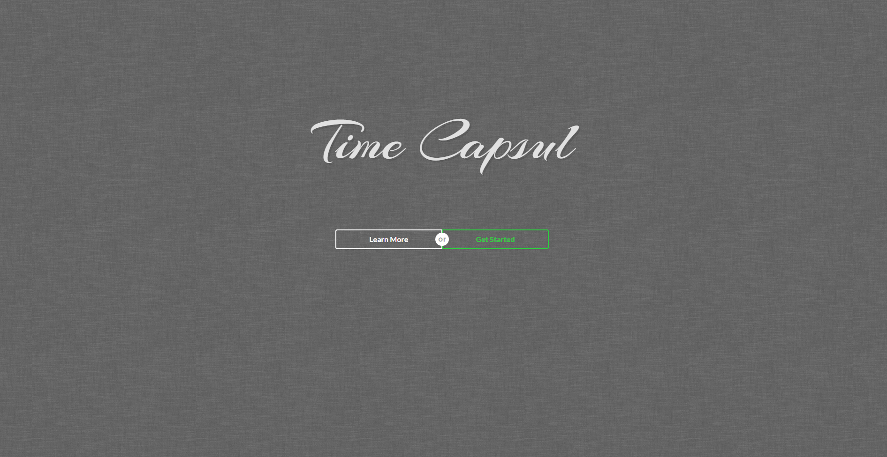
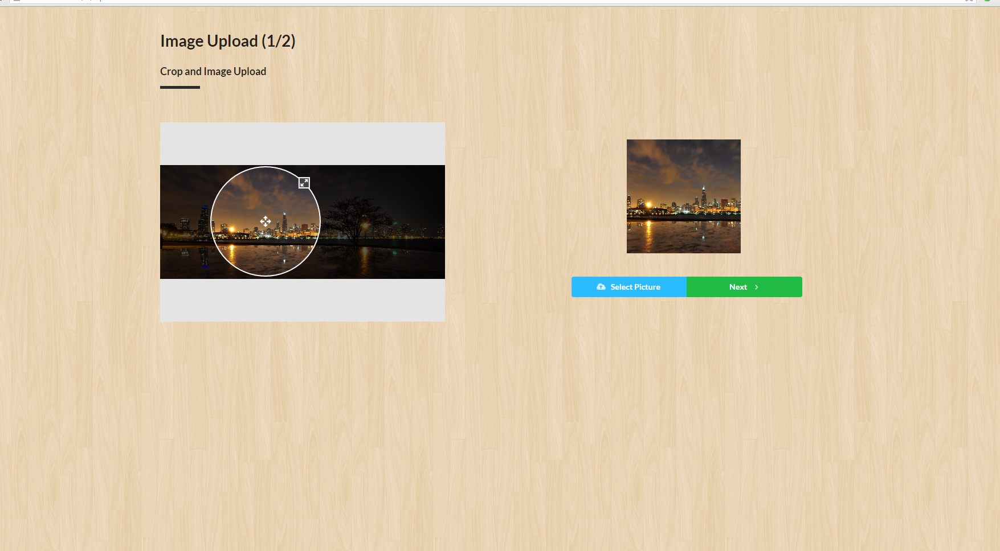
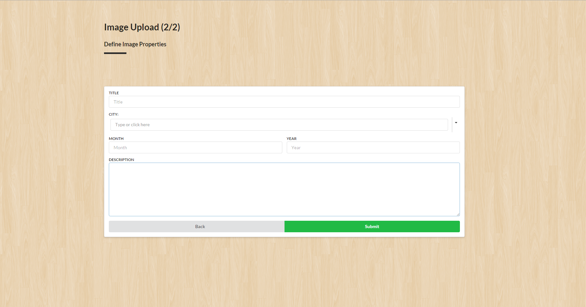

#Time Capsul
##About
Time Capsul is like a normal time capsule…<br>
Expect it is not buried in the ground, but in the cloud... 
And it doesn’t go offline… 
And it is always updating and backfilling…

I guess it’s not a time capsule at all

####What it Actually is:
>Time Capsul is cloud base platform for **publicly** documenting the world around us and what it once was.
>TimeCapsul asks its users to upload images from photo albums, frames, and even their phones. Then combine the images with a description to tell a story.
>By combining everyone’s history and heritage we can remember where we came from, explore new locations and their history, and as a community document a more accurate past. 
><br>
><br>
>Join us at [timecapsul.me/](http://timecapsul.me/)

##Site Overview
###Landing Page
Every Adventure must start somewhere. Go ahead and log in or sign up


###Dashboard
This is where you can control all of your operations. Feel free to poke around. More control are right around the corner, get excited!


###Capsule Page
Evoking an action that selects a city will bring you here. More features to come.


###Uploading Images
Uploading images is a two step process. First you upload your image and select the icon for it.

Next you write your story. 


##Take a Look Under the hood.
Time Capsul matains and uses a sepearte [public backend API](https://github.com/cbudo/TimeCapsule-Backend/) 

###Frontend Set Up
```bash
git clone https://github.com/Doolan/IvoryHacks.git
cd IvoryHacks
npm install #installs all of the packages
npm start #launches the site on http://localhost:3000/
```
###_Required Tools_
_Install these first_

1. [Node.js](https://nodejs.org/en/)
2. [Git](https://desktop.github.com/)
3. nodemon
```bash
npm install -g nodemon
```

###npm install errors
In the unlikely case Semanitic UI has installation errors:
```bash
npm install -g gulp
npm install semantic-u --save 
#Or

npm install
#Then
cd semantic-ui/
gulp build
```

